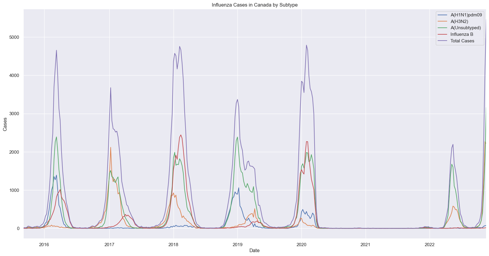

# Time Series Forecasting of Influenza in Canada

## Project
The aim of this project is to use supervised machine learning to predict the number of laboratory-confirmed influenza detections in Canada, 1, 2, 3, and 4 weeks in advance.

## Dataset
The dataset used for this project includes 377 weekly records from the 2015/2016 influenza season to present. Each record includes the number of confirmed detections for Influenza A (unsubtyped, H3N2, and H1N1), and Influenza B. Detections are reported to the Public Health Agency of Canada by 35 sentinel laboratories across the country, and compiled in the Government of Canada weekly Fluwatch surveillance reports (https://www.canada.ca/en/public-health/services/diseases/flu-influenza/influenza-surveillance/weekly-influenza-reports.html).

Weekly laboratory-confirmed detections were available to download as csv files for the 2015/2016 and 2016/2017 influenza seasons from the Government of Canada Open Data Portal (https://search.open.canada.ca/en/od/?search_text=fluwatch). Data for subsequent seasons was retrieved directly from the final weekly influenza report for each influenza season (Laboratory-Confirmed Influenza Detections section). 

## Motivation
Globally, an estimated 250,000 to 650,000 people die annually from influenza, and 3-5 million people suffer from severe illness. In Canada, there are approximately 7,000 influenza deaths every year (https://www150.statcan.gc.ca/t1/tbl1/en/tv.action?pid=1310039401). 

Because influenza is such a significant health threat, efforts to accurately forecast cases is an active area of research in epidemiology. Advanced notice of the timing and severity of influenza epidemics can inform public health decisions regarding:
- hospital staffing
- allocation of vaccines and antivirals
- when and where to target public health interventions

## Hypotheses
Before looking at the data, I hypothesized that the following would be predictors of influenza detections:

1. Number of search engine queries for flu symptoms
    - I anticipated a positive correlation between flu cases and flu symptom searches because individuals sick with these symptoms would be more likely to look them up online
2. Number of engine queries for COVID-related terms
    - I anticipated a negative correlation between flu cases and COVID-related terms because of reports that measures implemented to prevent the spread of COVID were also effective at preventing spread of much less virulent influenza virus 
3. Number of Canadians vaccinated against influenza
    - I anticipated a negative correlation between influenza detections and influenza vaccinations because of higher population immunity against the virus
4. Movement of individuals
    - I anticipated a positive correlation between flu cases and movement because influenza virus is spread through respiratory droplets during person-to-person contact.

To test these hypotheses, I collected the following datasets:

1. Google Trends Data (18 datasets for 18 search terms)
    - monthly scores on search interest in Canada from 2015 to present for each search term, downloaded as csv files (https://trends.google.com/trends/?geo=CA)
    - scores are between 0 and 100, representing search interest relative to the highest interest for the given region and time. A value of 100 is the peak popularity for the term. A value of 50 means that the term is half as popular. A score of 0 means that there was not enough data for this term.
    - 11 datasets for terms including cough, fever, runny nose, etc, based on symptoms of the flu as listed by the US CDC (https://www.cdc.gov/flu/symptoms/symptoms.htm)
    - 7 searches for COVID-19 related terms including social distancing, quarantine, lockdown, etc., partly based on popular COVID search terms identified by Google (https://trends.google.com/trends/story/US_cu_4Rjdh3ABAABMHM_en)
2. Transportation activity indicators, Transport Canada
    - monthly numbers of international and domestic air passengers from January 2017- August 2022, downloaded as a csv file
    - Statistics Canada. Table 23-10-0269-01  Transportation activity indicators, Transport Canada (https://www150.statcan.gc.ca/t1/tbl1/en/tv.action?pid=2310026901)
3. Passenger bus and urban transit statistics, by the North American Industry Classification System (NAICS)
    - monthly numbers of passenger trips on urban transit, Canada-wide from January 2017- August 2022, downloaded as a csv file
    - Statistics Canada. Table 23-10-0251-01  Passenger bus and urban transit statistics, by the North American Industry Classification System (NAICS) (x 1,000,000) (https://www150.statcan.gc.ca/t1/tbl1/en/tv.action?pid=2310025101)
4. Health characteristics, annual estimates
    - annual estimates from 2015-2021 on 29 health indicators, including influenza immunization in the past 12 months.
    - Statistics Canada. Table 13-10-0096-01  Health characteristics, annual estimates (https://www150.statcan.gc.ca/t1/tbl1/en/tv.action?pid=1310009601)

I will examine whether search engine queries, mobility data and health indicators are correlated with flu cases and determine if they can be used to build a machine learning model to forecast influenza cases.

## Process
### Step 1 - Data Preprocessing:
- summed detections for flu cases of each subtype every week to get total cases / week
- extracted week and year
- added epiweek, and extracted week ending date as datetime
- made 6 pickles:
    - full time series with and without subtypes
    - pre-COVID time series with and without subtypes
    - COVID time series with and without subtypes

### Step 2 - Exploratory Data Analysis:
Before building forecasts, I conducted some time series analyses to better understand the data.

First, I plotted the data to get a sense of overall trends:

There are several striking aspects to this plot:
- there is clear seasonality to cases
- there is an almost total absence of cases during the 2020/2021 influenza season
- the number of cases during the 2021/2022 influenza cases is significantly lower than in previous years, and occurred later in the year
- the number of cases in the most recent weekly report for the 2022/2023 influenza season (5,460) has already surpassed the peak of cases in the previous 7 influenza seasons shown.

Next, I made note of some general descriptive statistics. Because of the clear disruption to the time series beginning in March 2020, I have reported these statistics three ways: over the entire dataset, during the period prior to the COVID-19 pandemic, and during the period since the beginning of the COVID-19 pandemic.
1. Baseline (mean) flu level (bar plot for these?):
    - September 2015 to March 2020: 1010 laboratory-confirmed cases per week.
    - March 2020 to present: 276 laboratory-confirmed cases per week.
    - September 2015 to present: 733 laboratory-confirmed cases per week.

2. Standard deviation (bar plot for these?):

3. Autocorrelation (include plot):

4. Partial Autocorrelation (include plot):

5. Trend, Seasonality, Residual (include plot):

### Step 3 - Selection of Evaluation Metrics

### Step 4 - Baseline Model - Moving Average

### Step 5 - ARIMA Model

### Step 6 - Feature Engineering

### Step 7 - Building Supervised Learning Models

### Step 8 - Ensemble Models

### Step 9 - Hyperparameter Tuning

## Results

## Challenges
- getting granular enough data (e.g. mobility data at the daily level vs. monthly, or health indicators montly vs. annually)

## Future Goals
- other models - compartmental models, particle filtering, transformers
- other features - news article titles using NLP 

## Use Cases

