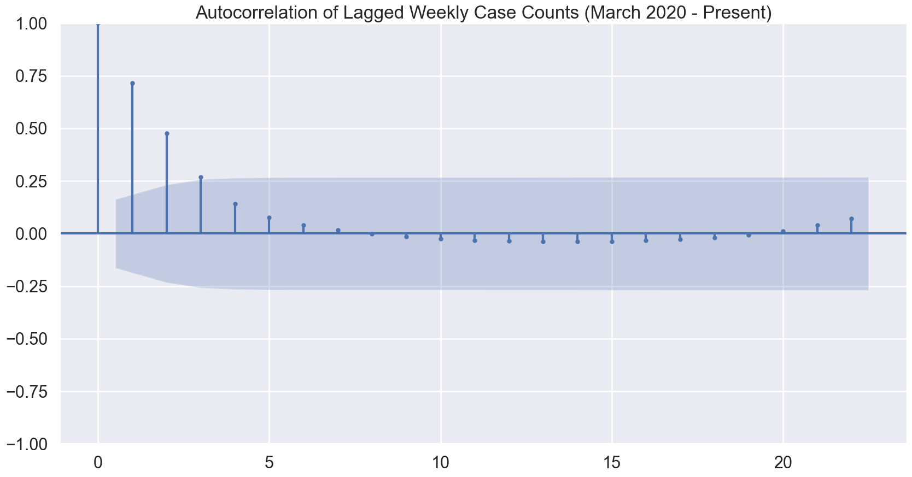
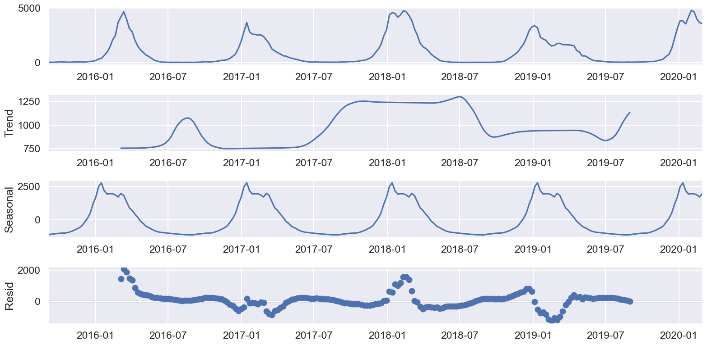
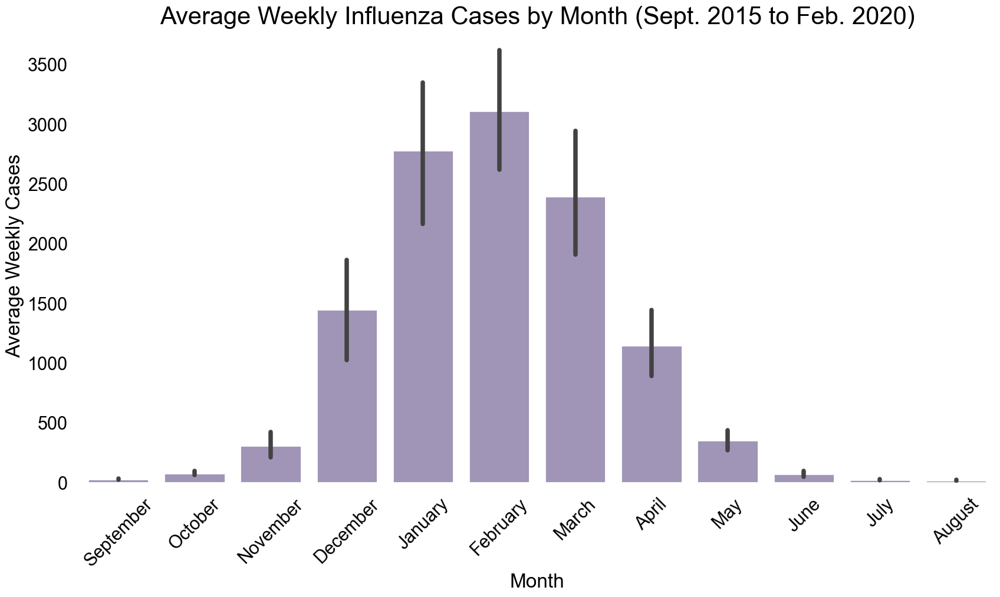
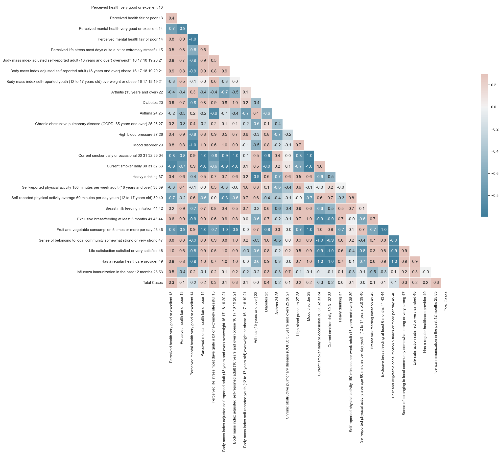
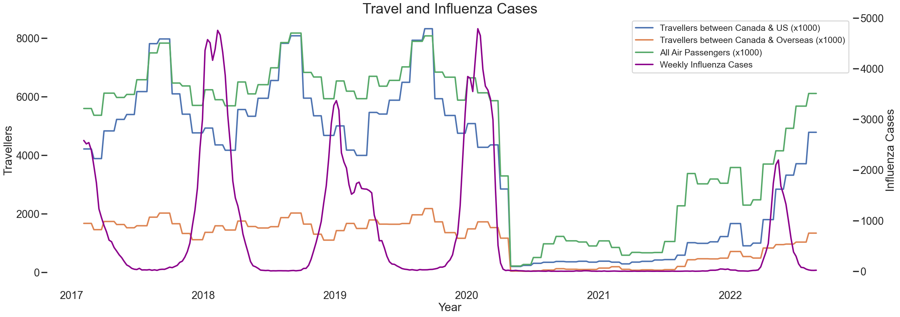
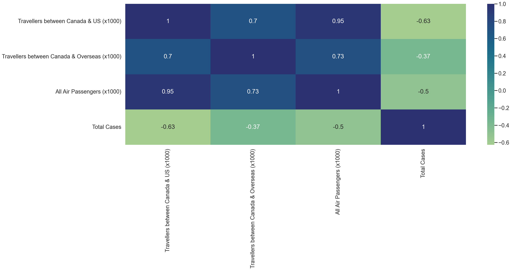
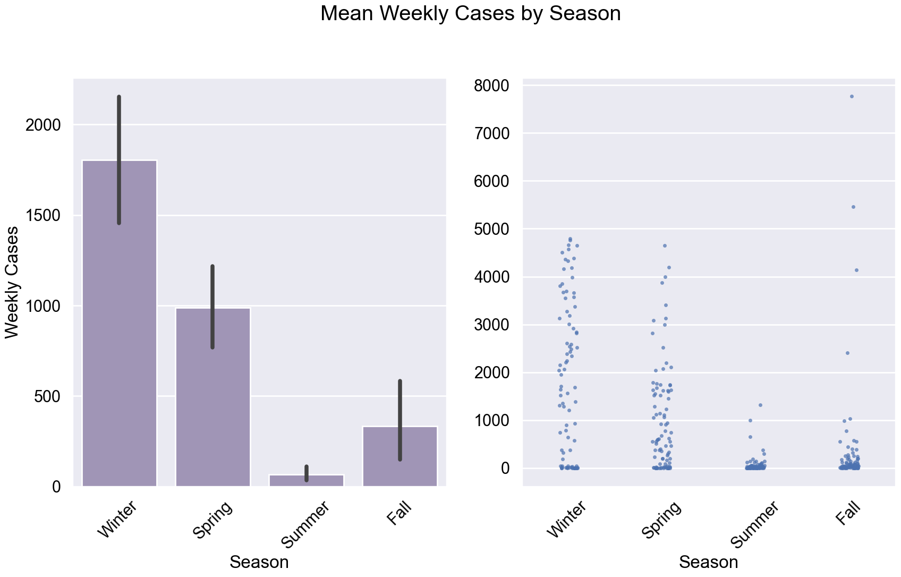
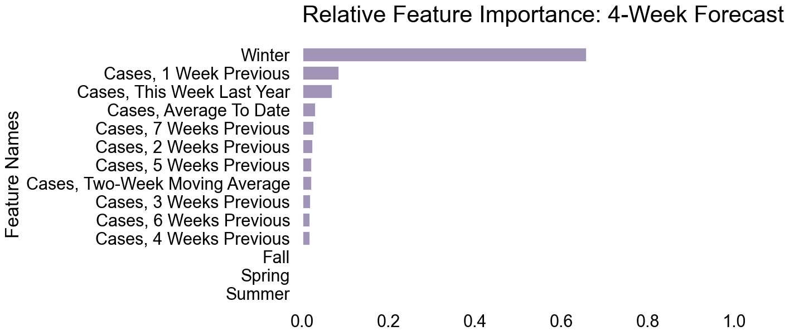

# Time Series Forecasting of Influenza in Canada

## Project
The aim of this project is to use supervised machine learning to predict the number of laboratory-confirmed influenza detections in Canada - 1, 2, 3, and 4 weeks in advance.

## Dataset
The dataset used for this project includes 378 weekly records from the 2015/2016 influenza season to November 26, 2022. Each record includes the number of confirmed detections for Influenza A (unsubtyped, H3N2, and H1N1), and Influenza B. Detections are reported to the Public Health Agency of Canada by sentinel laboratories across the country, and compiled in the Government of Canada weekly FluWatch surveillance reports (https://www.canada.ca/en/public-health/services/diseases/flu-influenza/influenza-surveillance/weekly-influenza-reports.html).

Weekly laboratory-confirmed detections were available to download as csv files for the 2015/2016 and 2016/2017 influenza seasons from the Government of Canada Open Data Portal (https://search.open.canada.ca/en/od/?search_text=fluwatch). Data for subsequent seasons were retrieved directly from the final weekly influenza report for each influenza season (Laboratory-Confirmed Influenza Detections section).

## Motivation
Globally, an estimated 250,000 to 650,000 people die annually from influenza, and 3-5 million people suffer from severe illness (https://bmcresnotes.biomedcentral.com/articles/10.1186/s13104-019-4393-y). In Canada, there are approximately 7,000 influenza deaths every year (https://www150.statcan.gc.ca/t1/tbl1/en/tv.action?pid=1310039401). 

Because influenza is such a significant health threat, efforts to accurately forecast cases is an active area of research in epidemiology. Advanced notice of the timing and severity of influenza epidemics can inform public health decisions regarding:
- hospital staffing
- allocation of vaccines and antivirals
- when and where to target public health interventions

## Hypotheses
Before looking at the data, I hypothesized that the following would be predictors of influenza detections:

1. Number of Canadians vaccinated against influenza
    - I anticipated a negative correlation between influenza detections and influenza vaccinations because of higher population immunity against the virus
2. Movement of individuals
    - I anticipated a positive correlation between flu cases and movement because influenza virus is spread through respiratory droplets during person-to-person contact (https://www.cdc.gov/flu/about/disease/spread.htm)
3. Number of search engine queries for flu symptoms
    - I anticipated a positive correlation between flu cases and flu symptom searches because individuals sick with these symptoms would be more likely to look them up online
2. Number of search engine queries for COVID-related terms
    - I anticipated a negative correlation between flu cases and COVID-related terms because of reports that measures implemented to prevent the spread of COVID were also effective at preventing spread of the much less virulent influenza virus (https://www.cbc.ca/news/health/covid-19-general-faq-1.5893936)

To test these hypotheses, I collected the following datasets:

1. Health characteristics, annual estimates
    - annual estimates from 2015-2021 on 29 health indicators, including influenza immunization in the past 12 months.
        - Statistics Canada. Table 13-10-0096-01  Health characteristics, annual estimates (https://www150.statcan.gc.ca/t1/tbl1/en/tv.action?pid=1310009601)
2. Transportation activity indicators, Transport Canada
    - monthly numbers of international and domestic air passengers from January 2017- August 2022, downloaded as a csv file
        - Statistics Canada. Table 23-10-0269-01  Transportation activity indicators, Transport Canada (https://www150.statcan.gc.ca/t1/tbl1/en/tv.action?pid=2310026901)
3. Passenger bus and urban transit statistics, by the North American Industry Classification System (NAICS)
    - monthly numbers of passenger trips on urban transit, Canada-wide from January 2017- August 2022, downloaded as a csv file
        - Statistics Canada. Table 23-10-0251-01  Passenger bus and urban transit statistics, by the North American Industry Classification System (NAICS) (x 1,000,000) (https://www150.statcan.gc.ca/t1/tbl1/en/tv.action?pid=2310025101)
4. Google Trends Data (18 datasets for 18 search terms)
    - monthly scores on search interest in Canada from 2015 to present for each search term, downloaded as csv files (https://trends.google.com/trends/?geo=CA)
    - scores are between 0 and 100, representing search interest relative to the highest interest for the given region and time. A value of 100 is the peak popularity for the term. A value of 50 means that the term is half as popular. A score of 0 means that there was not enough data for this term.
    - 11 datasets for terms including cough, fever, runny nose, etc., based on symptoms of the flu as listed by the US CDC (https://www.cdc.gov/flu/symptoms/symptoms.htm)
    - 7 searches for COVID-19 related terms including social distancing, quarantine, lockdown, etc., partly based on popular COVID search terms identified by Google (https://trends.google.com/trends/story/US_cu_4Rjdh3ABAABMHM_en)

I will examine whether search engine queries, mobility data and health indicators are correlated with flu cases and determine if they can be used to build a machine learning model to forecast influenza cases.

## Process
### Step 1 - Data Wrangling:
- loaded all datasets into a jupyter notebook using pandas
- removed irrelevant observations (e.g., RSV cases, urban transit revenue)
- addressed missing values (dropped the feature if there were too many missing values, or imputed the mean if only a few values were missing)
- reformatted datatypes as necessary (to numeric, DateTime, etc.)
- for all google trend, mobility, and health characteristic data: shifted the values forward one datapoint in order to use past data to predict future weekly influenza cases in a supervised learning model
- summed detections for flu cases of each subtype every week to get total cases / week
- added epiweek, and extracted week ending date as datetime
- extracted year and month from all datasets, and then merged them together into a single dataframe
- saved all individual and combined dataframes as pickles

### Step 2 - Exploratory Data Analysis:
Before building forecasts, I conducted exploratory analyses to better understand the data.

First, I plotted the influenza time series data to get a sense of overall trends:

There are several striking aspects to this plot:
- there is clear seasonality to cases
- there is an almost total absence of cases during the 2020/2021 influenza season
- the number of cases during the 2021/2022 influenza season is significantly lower than in previous years, and occurred later in the year
- as of writing, the number of cases in the most recent weekly report for the 2022/2023 influenza season (7,773 cases reported between November 20, 2022 and November 26, 2022) has already surpassed the peak of cases in the previous 7 influenza seasons shown.

Next, I made note of general descriptive statistics. Because of the clear disruption to the time series beginning in March 2020, I have reported these statistics during the period prior to the COVID-19 pandemic, and during the period since the beginning of the COVID-19 pandemic.

**Time Series Analysis:**
1. Baseline (mean) flu level:
    - September 2015 to March 2020: 1010 laboratory-confirmed cases per week.
    - March 2020 to present: 276 laboratory-confirmed cases per week.

2. Standard deviation:
    - September 2015 to March 2020: 1359 laboratory-confirmed cases per week.
    - March 2020 to present: 796 laboratory-confirmed cases per week.

3. Autocorrelation:
    Prior to the COVID-19 pandemic, weekly influenza cases are correlated with the six or seven previous weeks of influenza cases.  The same pattern is seen in the full time series from September 2015 to present.  Between March 2020 and present, only the previous two weeks of cases are correlated with weekly case counts.

    

    

    <!--  -->

4. Partial Autocorrelation:
    Prior to the COVID-19 pandemic, weekly influenza cases are directly correlated with the previous two weeks of influenza cases.  Across the full time series, and since the beginning of the COVID-19 pandemic, only the previous week of cases is directly correlated with weekly case counts.

    

    

    <!--     -->

5. Trend, Seasonality, Residual:
    Prior to the COVID-19 pandemic, there is a clear seasonal pattern to cases, but no clear trend. The COVID-19 pandemic disrupts the typical seasonal pattern.

    September 2015 to March 2020:
    

    March 2020 to Present:
    

    <!-- September 2015 to Present:
     -->

    The disruption to the seasonal pattern is evident when comparing the mean number of cases per month before and during the pandemic:

    September 2015 to February 2020:
    

    March 2020 to Present:
    

**Health Indicators:**
There are no clear relationships between health indicators and influenza cases in this dataset. This may be because the health indicator data is an annual statistic, and therefore the information is not granular enough to identify relationships. Moreover, the health indicator statistics are being compared to the following year's weekly influenza cases, so it is possible that even if health indicators and influenza cases are related during the current year, that relationship may not hold for health indicators from the previous year. Influenza immunization and influenza cases show a weak correlation of R = 0.3 prior to the pandemic, and R=-0.2 over the entire time series.

Prior to March 2020:
    

Full Dataset:
    

**International / Domestic Travel:**
As expected, there is a steep decline in international and domestic travel at the beginning of the COVID-19 pandemic. Prior to the pandemic, there is a seasonal pattern in travel, with volume peaking in the summer months.

Between September 2015 and March 2020, there is a large negative correlation between travel volume and influenza cases (R values between -0.5 to -0.6), which is surprising, as I had hypothesized that the relationship would be in the opposite direction. 

Over the time series as a whole, the relationship is in the opposite direction, with a moderate positive correlation between travel volume and influenza cases (R values between 0.19 and 0.32).

**Urban Transit:**
There was a steep decline in urban transit use in March 2020.  Although ridership has been slowly increasing, it is still far below the pre-pandemic levels. Prior to the pandemic, there does not appear to be a clear trend or seasonal pattern in urban transit use.

Prior to March 2020, there is a weak positive correlation between urban transit ridership and total influenza cases (R = 0.25).

Over the full time series, the positive correlation is stronger, with an R value of 0.45.

**Google Trends - Flu Symptoms:**
Prior to March 2020, Google searches for most flu symptoms (except fatigue and diarrhea) were highly correlated with total influenza cases.  The search terms 'fever', 'cough', and 'body aches' were most highly correlated, with R values of 0.81, 0.79 and 0.75 respectively.

When dates after March 2020 are included in the time series, these correlations are greatly reduced or disappear.

**Google Trends - COVID Terms:**
There are some weak correlations between COVID-19-related terminology and influenza cases prior to March 2020 (e.g., mask, coronavirus, quarantine). Other terms (e.g., lockdown, social distancing, COVID), are not correlated with influenza cases during this time period. This is to be expected, as some of these terms would have been unused or uncommon prior to March 2020.

Across the full time series, there are weak negative correlations between Google searches for COVID-19-related terms and influenza cases.

### Step 3 - Selection of Evaluation Metrics
There are a number of suitable Time Series Forecast Error Metrics, each with their own advantages and disadvantages - well explained in this article: https://towardsdatascience.com/time-series-forecast-error-metrics-you-should-know-cc88b8c67f27.

For this project, I had to rule out the Percentage-Error Metrics, as they become infinite or undefined for zero values in a time series (in some weeks in 2020/2021, zero influenza cases were reported).

Instead, I chose to use the Scale-Dependent Metrics of Mean Absolute Error, Mean Squared Error, and Root Mean Square Error to evaluate my forecasting models.

Unfortunately, these metrics are not suitable for comparing different time series, which makes it difficult to compare my model with benchmark models in the literature. Nevertheless, MAE and RMSE in particular are useful metrics because they can be interpreted in the units of the time series (aka weekly case numbers).

I used RMSE make comparisons between my different models because it penalizes large errors.

In order to be able to draw comparisons with benchmark models in the literature, I also calculated R Squared for each model, which is a measure of how well predicted cases follow the pattern of actual cases.

### Step 4 - Baseline Model - Moving Average
To get baseline evaluation metrics, I first prepared a two-week moving average model.  This model simply predicts that the next week of cases will be equal to the average of the previous two weeks of cases.

### Step 5 - ARIMA Model
Next, I tried a statistical forecasting method called ARIMA to forecast cases.

This model accepts three parameters: p, d and q.

The *parameter p* is related to the partial autocorrelation of lagged values. The optimal p value is chosen by selecting the time lag after which partial autocorrelation is no longer significant (aka has no effect on the current value). Based on the partial autocorrelation plot for both the pre-COVID and full time series, I chose a p value of 2 for both models.

The *parameter d* is related to the stationarity of the time series. Statistical methods are based on the assumption that the time series is approximately stationary, that is, that the statistical properties of the time series (mean, standard deviation, etc.), do not depend on time. If the time series is not stationary, the optimal d value is chosen by selecting the number of times differencing needs to be applied in order for the time series to become stationary.  This can be assessed by determining if the time series passes the ADF test.  Both the pre-COVID and full time series passed the ADF test for stationarity, so I used a d value of 0 for both models.

The *parameter q* is related to the past prediction errors of the model. The optimal q value is chosen by selecting the time lag after which autocorrelation is no longer significant.  Based on the autocorrelation plot for both the pre-COVID and full time series, I chose a q value of 6 for both models. 

Although both models fit the training set well, they were both inaccurate on the test set and performed more poorly than the moving average model.

### Step 6 - Feature Engineering
In addition to the mobility, google search and health indicator data that I found, I engineered features using the influenza time series itself.

**Date Time, Lag, Window Features:**

**Year:** Mean weekly cases are relatively stable across the years in the time series, with the notable exceptions of 2018 (a particularly bad influenza season), and 2021 (during the height of the COVID-19 pandemic).

**Month:** Across the full time series, there is a clear seasonal pattern with cases peaking in February on average, and almost disappearing in July, August, September.

**Season:** The seasonal pattern is demonstrated even more clearly in the following plot, with winter being the worst season for influenza, followed by spring.

The other features based on the influenza dataset are:
- weekly cases from the seven previous weeks
- two-week moving average
- expanding mean
- weekly cases from the same week of the previous year

### Step 7 - Building Supervised Learning Models

I trained a variety of Regression Models, including:
- Linear Regression
- K-Nearest Neighbours Regression
- Decision Tree Regression
- Random Forest Regression
- Gradient Boosting Regression

The Gradient Boosting Regression algorithm achieved the best results, and the date time, lag, and window features were the best predictors of cases.

## Results
The following plots show the performance of the Gradient Boosting Regression model on 1-week and 4-week ahead models. As expected, the 1-week ahead model is more accurate, with predicted cases closely fitting actual cases on the test data.

The Gradient Boosting Regressor model outperformed the baseline moving average model and the ARIMA model for the full dataset on all evaluation metrics:

Moving Average:

ARIMA:

Gradient Boosting Regressor:

## Forecasts
The following plot shows the current 4-week ahead forecast for influenza cases in Canada using the Gradient Boosting Regressor model to make predictions.

## Challenges
The extreme surge in influenza cases in the 2022 season so far makes it difficult to make reliable predictions about the future, because the data that the model is attempting to make predictions on looks very different from the dataset it was trained on.

Another challenge is related to the disruption to the seasonal pattern of influenza during and after the COVID-19 pandemic, which also makes it difficult for the model to learn patterns. For example, there was no 2020/2021 influenza season, and the 2021/2022 influenza season was delayed.

Finally, getting granular enough data is also a challenge and limits the usefulness of incorporating non-time series data into the model. Perhaps with daily instead of monthly mobility data, or monthly instead of annual health indicators statistics, these features would be more useful predictors of influenza cases.

## Future Goals
In terms of next steps, it would be interesting to try training more complex models, such as compartmental models with particle filtering, or transformer models. These models have been proven to perform well in time series forecasting for influenza.

Other features, such as COVID-19 case counts, or news article titles incorporated using Natural Language Processing, may also improve model performance.

